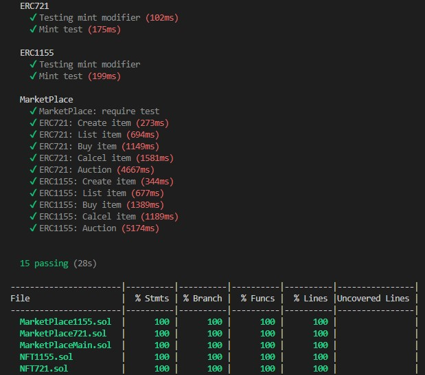

  

Написаны контракты для стандартов:
* [ERC20](https://rinkeby.etherscan.io/token/0x44FdaF8FB8E3BFA1744362F0C146B184e80cD6D9)  
* [ERC721](https://rinkeby.etherscan.io/token/0x0f7607F100d53ab97371ED6B0D9593C1A2BBC859)  
* [ERC1155](https://rinkeby.etherscan.io/token/0x1472EA2Db467E06C75b78589C1AA0E05cCEf9e51)   

Для стандартов ERC721 и ERC1155 написаны контракты, реализующие логику маркетплейса:  
* [MarketPlace721](https://rinkeby.etherscan.io/address/0x1e427Fd28d814B28e6efaE72D2E09932f69a89BC)  
* [MarketPlace1155](https://rinkeby.etherscan.io/address/0xB88Ac232e9065443f80faa6A9468fF5C6aEe5295)   

Реализован контракт самого маркетплейса, взаимодействующий со всеми описанными выше контрактами:  
* [MarketPlaceMain](https://rinkeby.etherscan.io/address/0x85FA53Be75191C28b1e0BeFb76DD634260cb9617)   

Для удобства работы с delegatecall был реализован базовый контракт BaseMP.sol  
На ipfs были загружены два файла:  
* Для ERC721 https://ipfs.io/ipfs/QmfCECP4dpA9YujBFfX7EkXNiesQvYo31k6ZYJkfayzGTY/Users/Acer/Desktop/_Crypton/week3/ipfs/black.json  
* Для ERC1155 в количестве 100 штук https://ipfs.io/ipfs/QmcRFEBJ9Z2PeChgSUqATGdTSihfVWMSQ89Kboi5B3xPUT/Users/Acer/Desktop/_Crypton/week3/ipfs/not_black.json  

Все контракты верифицированы.    
Ссылки на OpenSea:  
* https://testnets.opensea.io/assets/rinkeby/0x0f7607f100d53ab97371ed6b0d9593c1a2bbc859/0  
* https://testnets.opensea.io/assets/rinkeby/0x1472ea2db467e06c75b78589c1aa0e05ccef9e51/0  
